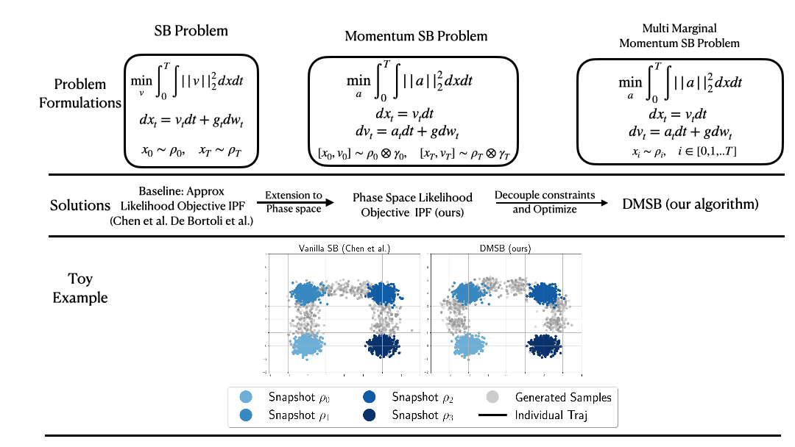

# (NeurIPS2023) DMSB: Deep Momentum Multi-Marginal Schrödinger Bridge [[LINK](https://arxiv.org/pdf/2303.01751.pdf)]

Official PyTorch implementation of the paper 
"_<ins>**D**</ins>eep <ins>**M**</ins>omentum  Multi-Marginal <ins>**S**</ins>chrödinger <ins>**B**</ins>ridge_  (**DMSB**)" 
which introduces
a new class of trajectory inference models that extend SB models to momentum dynamcis and multi-marginal case.
## Connection with Vanilla Schrödinger Bridge
 

## Toy Examples
| Tasks (`--problem-name`)      | Results|
|-------------------------      |-------------------------|
| Mixture Gaussians (`gmm`)     | <p float="left">   </p> |
| Semicircle (`semicircle`)     | <p float="left">   </p> |
| Petal (`Petal`)               | <p float="left">   </p> |
| 100-Dim Single Cell RNA sequence (`RNAsc`) | <p float="left">   </p> |
If you find this library useful, please cite :arrow_down:
```
@article{chen2023deep,
  title={Deep Momentum Multi-Marginal Schr$\backslash$" odinger Bridge},
  author={Chen, Tianrong and Liu, Guan-Horng and Tao, Molei and Theodorou, Evangelos A},
  journal={arXiv preprint arXiv:2303.01751},
  year={2023}
}
```

# Installation

(Environment may have conflict with cuda version... I am currently fixing it... but it should work for most of cuda...)This code is developed with Python3. PyTorch >=1.7 (we recommend 1.8.1). First, install the dependencies with [Anaconda](https://www.anaconda.com/products/individual) and activate the environment `DMSB` with
```bash
conda env create --file requirements.yaml python=3.8
conda activate DMSB
```

Download the RNA-seq daaset from [this repo](https://github.com/KrishnaswamyLab/TrajectoryNet/blob/162e6c77728135f27ad04f1c83d78a319e79dff4/data/eb_velocity_v5.npz), and put it under `./data/RNAsc/ProcessedData/`.
# Reproducing the result in the paper
****
We provide the checkpoint and the code for training from scratch for all the dataset reported in the paper.

### GMM
```bash
python main.py --problem-name gmm --dir reproduce/gmm --log-tb --gpu 1
```
**Memo: The results in the paper sould be reproduced by around 6 stage of Bregman Iteration.**

### Petal
```bash
python main.py --problem-name petal --dir reproduce/petal --log-tb
```
**Memo: The results in the paper sould be reproduced by around 17 stage of Bregman Iteration.**

### RNAsc
```bash
python main.py --problem-name RNAsc --dir reproduce/RNA --log-tb  --num-itr 2000
python main.py --problem-name RNAsc --dir reproduce/RNA-loo1 --log-tb  --use-amp --num-itr 2000 --LOO 1
python main.py --problem-name RNAsc --dir reproduce/RNA-loo2 --log-tb  --use-amp --num-itr 2000 --LOO 2
python main.py --problem-name RNAsc --dir reproduce/RNA-loo3 --log-tb  --use-amp --num-itr 2000 --LOO 3
```

****
# Where Can I find the results?
The visualization results are saved in the folder `/results`.

The numerical value are saved in the tensorboard and event file are saved the folder `/runs`,

The checkpoints are saved in the folder `/checkpoint`, and you can reload the checkpoint by:
```bash
python main.py --problem-name [problem-name] --dir [your/dir/name/for/current/run] --log-tb  --load [dir/to/checkpoints/]
```

The numerical results for all metrics will be displayed in the terminal as well.